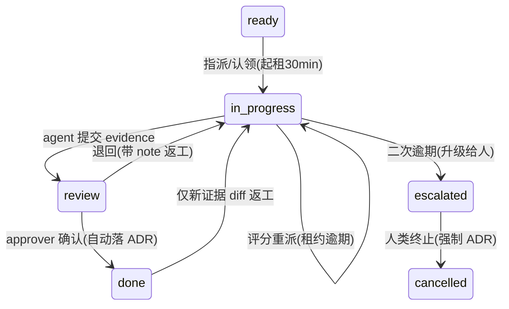

# Agent Harness (npm: 0xagent)

> 生产级 AI Agent 框架。插件化架构、多模型支持、安全沙箱、持久化会话、向量记忆、并行调度、MCP 协议兼容、跨网络多 Agent 协作（渠道中继 + 协调闸门 + 任务/决策/承诺硬对象）。

[](https://www.npmjs.com/package/0xagent)
[](https://www.typescriptlang.org/)
[](LICENSE)

## 简介

Agent Harness 是一个受 [DeepSeek Harness](https://github.com/deepseek-ai/awesome-deepseek-integration) 和 [OpenAI Codex CLI](https://github.com/openai/codex) 启发的 AI Agent 框架。从零开始构建，目标是提供一个**类型安全、可扩展、生产就绪**的 Agent 运行时。

**核心理念：**
- **插件优先**：所有能力都是插件，不侵入核心
- **零依赖默认**：核心框架不依赖外部服务，可选能力按需加载
- **安全第一**：代码执行沙箱化，操作需审批
- **持久化**：SQLite ACID 持久化，重启后状态不丢失
- **多模态**：支持 OpenAI、MiniMax 等多种模型，一键切换

---

## 功能特性

### 已实现的完整功能栈

| 模块 | 特性 | 状态 | 说明 |
|------|------|------|------|
| **核心架构** | 插件系统 | ✅ | Kernel + ServiceRegistry + EventBus |
| | TypeScript 严格模式 | ✅ | 完整类型推导 |
| **模型层** | OpenAI 兼容 | ✅ | GPT-4 / GPT-3.5 / 自定义兼容端点 |
| | MiniMax 国区 | ✅ | MiniMax-M3，国内直连 |
| | 多模型热切换 | ✅ | 改配置即可切换 |
| **工具层** | 文件系统 | ✅ | 读写文件、目录操作 |
| | Shell 执行 | ✅ | 带超时和目录限制 |
| | 代码执行 | ✅ | JavaScript / Python / Bash |
| | 自定义工具 | ✅ | 简单函数即可注册 |
| **安全** | 进程沙箱 | ✅ | 临时目录 + 超时 + 输出限制 |
| | Docker 沙箱 | ✅ | 容器隔离 + 内存/CPU 限制 |
| | 审批策略 | ✅ | auto / confirm / reject 三级 |
| | 危险命令拦截 | ✅ | rm -rf /、fork bomb 等 |
| **会话管理** | Item/Turn/Thread 原语 | ✅ | Codex-inspired |
| | 内存存储 | ✅ | 开发调试 |
| | SQLite 持久化 | ✅ | ACID + 搜索 + Fork |
| | 向量记忆 | ✅ | RAG 检索历史上下文（按 thread 隔离，跨会话检索走显式 API） |
| | 上下文压缩 | ✅ | 阈值触发 + 摘要 |
| **通信协议** | Agent Bus (内存) | ✅ | 同进程通信 |
| | Agent Bus (HTTP) | ✅ | P2P / Registry 中继 / 渠道隔离 |
| | 协调闸门 | ✅ | lapping / verbatim-dup / 速率地板 / seen-cursor / hold-token |
| | 多 agent 聊天室 | ✅ | @ 点名、自主插嘴判断、上下文互评 |
| | 任务板 | ✅ | Task/Lease/评分重派/验收/ADR |
| | 决策板 | ✅ | quorum/timebox/anti-reopen/结构化升级 |
| | 承诺与依赖 | ✅ | promise 确认入图、阻塞驱动催办 |
| | Focus window | ✅ | in_progress 租约=深度工作期，只放行直聊/关键路径催办，其余批量摘要补发 |
| | MCP Server | ✅ | 对外暴露工具 |
| | MCP Client | ✅ | 调用外部 MCP 工具 |
| | WebSocket | ✅ | 实时双向通信 |
| **Web UI** | 聊天界面 | ✅ | 现代化 React-less 前端 |
| | Thread 管理 | ✅ | 创建 / 切换 / Fork / 归档 |
| | 实时流式 | ✅ | WebSocket 推送 |
| | 审批弹窗 | ✅ | 人工确认操作 |
| **调度** | 子 Agent 并行 | ✅ | Map-Reduce 模式 |
| | 任务路由 | ✅ | 关键字自动分配 |
| | 结果聚合 | ✅ | LLM 合成多 Agent 输出 |
| **可观测性** | 执行追踪 | ✅ | 全链路事件 |

---

## 架构设计

```
┌─────────────────────────────────────────────────────┐
│                    Client Layer                      │
│   CLI (stdio) / Web UI (WebSocket) / MCP Client     │
├─────────────────────────────────────────────────────┤
│                  App Server                          │
│   JSON-RPC  │  Thread Manager  │  Turn Executor      │
├─────────────────────────────────────────────────────┤
│                    Agent Core                        │
│   Prompt Builder │ Approver │ Compactor │ Memory     │
├─────────────────────────────────────────────────────┤
│                  Execution Layer                     │
│   Model Provider │ Tool Registry │ Parallel Scheduler│
├─────────────────────────────────────────────────────┤
│                   Sandbox Layer                      │
│   Process Sandbox │ Docker Sandbox │ Danger Filter   │
├─────────────────────────────────────────────────────┤
│                  Persistence Layer                   │
│   SQLite (Thread/Turn/Item) │ Vector Memory (RAG)   │
└─────────────────────────────────────────────────────┘
```

---

## 快速开始

### 方式一：npm 全局安装（推荐）

```bash
npm install -g 0xagent    # 需要 Node >= 22
```

提供 5 个命令：

| 命令 | 用途 |
|------|------|
| `agent-harness` | CLI 交互模式（stdio REPL） |
| `agent-harness-v2` | CLI V2（Codex 风格 Thread/Turn） |
| `agent-harness-server` | Web UI 无头服务（含多 agent 聊天室，:3456） |
| `agent-harness-registry` | Agent Bus 渠道中继（放公网节点，:9876） |
| `bus-agent` | 独立总线 agent（加入渠道、应答/插嘴/执行任务） |

```bash
# 1. Web UI（最常用）
export AGENT_MODEL_PROVIDER=minimax MINIMAX_API_KEY=sk-...
agent-harness-server    # 打开 http://localhost:3456

# 2. Registry 中继（多 agent 跨网络协作时，放公网节点）
agent-harness-registry  # 默认 :9876，REGISTRY_PORT 可改

# 3. 在任意机器上加一个 agent 进群
AGENT_ID=gpu-agent REGISTRY_URL=http://<registry>:9876 \
BUS_CHANNEL=team MINIMAX_API_KEY=sk-... bus-agent

# 4. CLI 对话
agent-harness-v2
```

### 方式二：源码构建

```bash
git clone https://github.com/RokiRan/0xAgent.git
cd 0xAgent
npm install
npm run build && npm test
```

### 环境配置

```bash
# 方案一：OpenAI
export OPENAI_API_KEY=sk-...

# 方案二：MiniMax 国区
export MINIMAX_API_KEY=sk-...
export MINIMAX_BASE_URL=https://api.minimaxi.com/v1
export MINIMAX_MODEL=MiniMax-M3
# 可选：双脑分流——judge/vote/promise/verify 走小脑（不设则全部走主模型）
export MINIMAX_MODEL_SMALL=MiniMax-M2.5

# 可选：持久化路径
export AGENT_DB_PATH=./data/threads.db
```

### 源码模式启动

```bash
# 1. CLI 模式（stdio）
npm run dev

# 2. Web UI 模式（WebSocket + HTTP，无头服务，含多 agent 聊天室）
AGENT_MODEL_PROVIDER=minimax MINIMAX_API_KEY=sk-... \
BUS_REGISTRY_URL=http://localhost:9876 npm run server
# 打开 http://localhost:3456

# 3. Registry 中继
npm run registry

# 4. MCP Server 模式：由 mcp 插件按配置激活（config.server.enabled + transport:'stdio'），
#    见 src/mcp/plugin.ts；无独立 npm script
```

### 最小代码示例

```typescript
import { HarnessV2 } from './harness-v2.js';

const agent = new HarnessV2({
  modelProvider: 'minimax',
  model: {
    apiKey: process.env.MINIMAX_API_KEY!,
    baseUrl: 'https://api.minimaxi.com/v1',
    model: 'MiniMax-M3',
  },
  filesystem: { rootPath: './workspace' },
  agent: {
    maxIterations: 10,
    systemInstruction: 'You are a helpful coding assistant.',
  },
  persistence: { dbPath: './data/threads.db' },
  enableMemory: true,
  transports: ['stdio', 'websocket'],
  webUI: { enabled: true, port: 3456 },
});

await agent.start();
```

---

## 核心概念

### 1. Thread / Turn / Item 三原语

受 OpenAI Codex CLI 启发，会话管理采用三级结构：

- **Thread**：会话线程，独立上下文边界
- **Turn**：单次用户输入到 Agent 响应的完整回合
- **Item**：Turn 内的原子消息单元（用户输入、Assistant 回复、工具调用、工具结果）

```typescript
// 创建线程
const thread = threadManager.create();

// Fork 线程（保留历史，独立发展）
const forked = threadManager.fork(thread.id);

// 归档线程
threadManager.archive(thread.id);
```

### 2. 审批策略

三级策略控制工具执行：

```typescript
const approval = {
  autoApprove: ['filesystem:read'],  // 自动放行
  confirm: ['filesystem:write', 'shell'],  // 需确认
  reject: ['rm', 'mkfs'],  // 直接拒绝
};
```

### 3. 上下文压缩

当 Token 数超过阈值时，自动压缩历史：

```typescript
const compactor = new ContextCompactor({
  tokenThreshold: 12000,  // 触发阈值
  summaryModel: modelProvider,  // 用于摘要的模型
});

// 自动保留最近 N 轮，老消息摘要化
```

### 4. 向量记忆

无需外部向量数据库，轻量 RAG：

```typescript
const memory = new ThreadMemory();

// 自动索引
memory.indexThread(thread);

// 检索相关上下文（可选 threadId 限定会话范围；
// agent 对话轮内自动按当前 thread 隔离，防跨会话泄漏）
const context = memory.getRelevantContext("帮我优化那个函数");
// 返回: "Relevant previous context: [assistant]: ..."
```

---

## 插件系统

### 内置插件

| 插件 | 功能 |
|------|------|
| `model:openai` | OpenAI API 兼容模型 |
| `model:minimax` | MiniMax 国区 API |
| `tool:filesystem` | 文件读写、目录操作 |
| `tool:shell` | Shell 命令执行 |
| `sandbox:process` | 进程级代码沙箱 |
| `sandbox:docker` | Docker 容器沙箱 |
| `session:memory` | 内存会话存储 |
| `session:persistence` | JSON 文件持久化 |
| `agent-loop:react` | ReAct 决策循环 |
| `agent:bus` | 多 Agent 通信 |
| `mcp` | MCP 协议适配 |

### 自定义插件

```typescript
import { Plugin } from './core/plugin.js';
import { Tool } from './plugins/tools/interface.js';

const myTool: Tool = {
  name: 'weather',
  description: '获取城市天气',
  parameters: {
    type: 'object',
    properties: { city: { type: 'string' } },
    required: ['city'],
  },
  async execute(args) {
    return { temp: 24, condition: 'sunny' };
  },
};

export const myPlugin: Plugin = {
  name: 'tool:weather',
  dependencies: ['tool:registry'],
  async activate(ctx) {
    const registry = ctx.services.get('tool:registry') as any;
    registry.register(myTool);
  },
};
```

---

## 多 Agent 并行调度

### 基础用法

```typescript
import { ParallelScheduler } from './core/scheduler.js';

const scheduler = new ParallelScheduler(
  {
    agents: [
      { id: 'coder', systemPrompt: 'You are a code expert.', tools: ['shell', 'code'] },
      { id: 'writer', systemPrompt: 'You are a writer.', tools: ['filesystem'] },
    ],
    maxConcurrency: 3,
  },
  modelProvider,
  toolRegistry
);

// 并行执行
const results = await scheduler.runParallel([
  { id: 'task-1', description: 'Write a fibonacci function', agentId: 'coder' },
  { id: 'task-2', description: 'Write documentation', agentId: 'writer' },
]);

// 聚合结果
const summary = await scheduler.aggregate('Create a math library', results);
```

### Map-Reduce 模式

```typescript
const documents = ['doc1.txt', 'doc2.txt', 'doc3.txt'];

const summary = await scheduler.mapReduce(
  documents,
  (doc) => ({
    id: doc,
    description: `Summarize ${doc}`,
  }),
  async (results) => {
    // 自定义聚合逻辑
    return results.map(r => r.output).join('\n');
  }
);
```

---

## 多 Agent 协作（Agent Bus）

跨网络多 agent 协作系统：Registry 中继（公网节点）+ Bus Agent（各地执行体）+ Web Gateway（聊天室桥）。协调机制移植自 cumora 的工程实践：**并发与一致性用代码硬闸，判断与表达用模型**。

### 架构

```
┌────────────┐   broadcast/relay   ┌──────────────────┐
│ bus-agent  │ ◄────poll(2s)─────  │  Registry (公网)  │
│ (树莓派)   │                     │  channels/queues  │
└────────────┘                     │  协调闸门 + 指标  │
┌────────────┐                     └──────────────────┘
│ bus-agent  │ ◄──────────────────────────▲
│ (Mac/任意) │                            │ register/heartbeat(30s)
└────────────┘                            │
┌────────────┐   WS   ┌─────────────────┐ │
│  Web UI    │ ◄────► │ Harness Server  │─┘
│ (聊天室)   │        │ (web-gateway)   │
└────────────┘        └─────────────────┘
```

### 渠道（Channel）

消息按渠道隔离。`default` 渠道自动加入；`/register` 心跳每 30s 自愈渠道成员资格（registry 重启无需重启 agent）；3 分钟无心跳的成员被清扫。

**安全与持久化**：
- `BUS_TOKEN`：设置后所有端点（含 `/poll`）要求 `x-bus-token` 头，agent/gateway 端同名 env 注入；不设则开放（仅建议内网）。
- `REGISTRY_STATE_FILE`：registry 快照落盘（agents/channels/queues，1s 防抖，原子替换）——**在途消息重启不丢**（邮箱模型：落盘是唯一事实源，唤醒可丢）。
- 保留策略（gateway 侧，启动 + 每日）：`room_messages` 每房间保留最近 500 条；`done/cancelled` 任务与 `decided` 决策保留 90 天；principles 不删。

| 端点 | 说明 |
|------|------|
| `POST /channels/create` | 创建（幂等），创建者加入 |
| `POST /channels/join` `/leave` | 加入/退出 |
| `POST /channels/delete` | 删除（`default` 受保护） |
| `GET /channels` `/channels/members?channel=X` | 列表/成员 |
| `GET /metrics` | 闸门计数（held 按原因、broadcasts、evicted） |

### 协调闸门（Registry 硬机制）

| 闸门 | 行为 | 语义 |
|------|------|------|
| **lapping** | 无人类时，agent 消息数 > 不同发言者数 → 429 HELD | 死循环判据自扩展 |
| **两档地板** | 人类 10 分钟内在场：cap=6（自适应 `max(6, μ+2σ)`）；人类离开：严格 lapping | 人在场的讨论有界放开 |
| **verbatim-dup** | 同 `(channel, from)` 逐字重复 → 409 HELD | 不可被 override 绕过 |
| **速率地板** | 30 条/分钟/agent，**人类流量永不节流** | 内容盲成本地板 |
| **seen-cursor 新鲜度** | 发言前有未读消息 → 409 HELD 并**内联未读**，agent 重算后重试 | 游标独立于读取路径 |
| **hold-token** | override 令牌绑定已展示 seq、120s TTL、单次消费、过期拒收 | 覆盖=对已展示状态的确认 |

人类消息重置全部循环计数（人类是复位器）。stale agent 3 分钟清扫。

### 聊天室（Web UI）

- 房间 = 渠道；侧边栏创建/切换，成员徽章实时显示
- **@ 点名**：request/response 强制应答；**不 @**：逐成员 relay + 各 agent 自主判断（judge，fail-closed），反附和规则防互吹
- agent 上下文按 token 预算装配（`BUS_CONTEXT_TOKENS`，默认 3000，字符/2 估算），超预算省略显式报数、单条超长带截断标记——agent 知道记录不完整
- **Focus window**：agent 持有 `in_progress` 租约时房间消息进个人摘要队列（cap 50），窗口结束（任务流转/租约回收/30s 巡检）一次性补发；@ 直聊与关键路径催办永不拦截
- agent 回复带思考链折叠块 + 耗时，Markdown 渲染（DOMPurify 消毒）

### 任务板（Task/Contract + Lease）



不变量：acceptance 非空才能开工；approver ≠ owner；重派评分 = 在场 − 负载×10 + 历史成功率×10（纯 DB 事实）。高风险任务（`risk: 'high'`）停在 `pending_approval`，人工确认才派发。

### 决策板（Decision）

`decision/open` 发起表决 → 全体在场 agent 收票（LLM 选项+理由）→ quorum 达成即 `decided`；timebox 到点未决 → `escalated`（四行结构化封套：要决定什么/选项与票数/默认项/时限后果）；人类再超时 → 采用默认项（`auto_default`）。`decided` 只有新证据 diff 可 reopen。

### 承诺与依赖（Commitment）

`promise/create` 产生承诺候选，**agent 确认后才入依赖图**；`dep/add` 登记依赖边（防环）。阻塞驱动催办：只点名关键路径上逾期的阻塞者，同一依赖边 45 分钟冷却。

### LLM 台账与双脑（cumora §7 适配）

- **台账**：每次出站 LLM 调用记账（agent/purpose/model/token/延迟/状态）。server 侧经 `RecordingProvider` 装饰器在 provider 层收口（漏点为零）落 SQLite `llm_calls`；agent 侧上报 registry `POST /llm-calls`（追加 JSONL）——系统记账走系统通道，不污染对话通道不计入 rounds。fire-and-forget：记账失败绝不阻塞调用；provider 未报用量时 `measured=false` 记 0，**绝不猜测**
- **双脑**：reply/task 走主模型（`MINIMAX_MODEL`），judge/vote/promise/verify 走小脑（`MINIMAX_MODEL_SMALL`，未设回落主模型——策略收口在位，行为不变）
- 查询：`llm/stats` 合并 server（SQLite）与 agents（registry JSONL）两侧聚合视图

### 验收门（Verify，cumora §10.1.1 适配）

agent 提交任务 evidence 后、进 `review` 前，小脑对账 acceptance × evidence（「确认 ≠ 交付」）。`complete=false` → 自动退回返工并附 `next_step`；连续 2 次不过仍进 `review` 但标红留人裁；验收器自身故障按 `complete:false` 处理——宁可多烧跳数不放过假完成。

### 定时提醒（future-you，cumora §9.2.1 适配）

`reminder/create`（或 agent 经 bus request `kind:'reminder'` 直连 gateway）把"我以后再做"变成服务器担保的唤醒：60s tick 到点 → 系统消息落房 + 直连唤醒 assignee。派发幂等（`UPDATE ... WHERE status='pending'` 认领），投递失败不回滚——房间记录兜底，agent 下次活跃自然补见。

### 事故著录

多 agent 协调的反模式与事故记录（含常量校准依据）见 [docs/COORDINATION.md](docs/COORDINATION.md)。改协调闸门数值前必读。

### 编码引擎（Coding Engine，BYOA 最小版）

agent 的编码任务可委派给真实编码 CLI 执行——产出是真实文件副作用而非空谈：

```bash
# bus-agent 环境变量
CODING_ENGINE=omp        # 或 claude；不设 = LLM-only 旧行为
CODING_WORKDIR=/tmp/0xagent-work   # 默认 $TMPDIR/0xagent-work（刻意不落仓库根：引擎持写权限，边界必须显式）
CODING_TIMEOUT_MS=240000           # 默认 240s（< task-board 5min 派发超时）
CODING_BIN=/path/to/binary         # 可选，覆盖二进制路径
```

- **omp**：`omp -p --auto-approve --no-session`，本机已装即可用，无 per-call 成本
- **claude**：`claude -p --output-format json --permission-mode bypassPermissions`，JSON 输出自带 `total_cost_usd` 回传
- 引擎调用按 `purpose='task'`、`model='engine:<id>'` 入台账；token 不可得时 `measured=false` 记 0 不猜
- 新增引擎 = 实现 `CodingEngine` 接口（`src/plugins/engine/index.ts`），bus-agent 主流程无感

### 部署

```bash
# Registry（公网节点，单文件零依赖）
npx esbuild src/registry-server.ts --bundle --platform=node --format=esm --outfile=registry.mjs
REGISTRY_PORT=9876 REGISTRY_STATE_FILE=./registry-state.json \
REGISTRY_LEDGER_FILE=./llm-calls.jsonl \
BUS_TOKEN=shared-secret node registry.mjs

# Bus Agent（任意机器）
npx esbuild src/bus-agent.ts --bundle --platform=node --format=esm --outfile=bus-agent.mjs
AGENT_ID=pi-agent REGISTRY_URL=http://registry:9876 BUS_CHANNEL=team \
BUS_TOKEN=shared-secret \
AGENT_PERSONA="树莓派/嵌入式/Linux运维专家" \
MINIMAX_API_KEY=sk-... node bus-agent.mjs

# Web 服务端（含聊天室 gateway）
AGENT_MODEL_PROVIDER=minimax MINIMAX_API_KEY=sk-... \
BUS_REGISTRY_URL=http://registry:9876 BUS_CHANNELS=team \
BUS_TOKEN=shared-secret npm run server
```

无 LLM key 的 bus-agent 自动降级为静默模式（不判断、不插嘴、不轻诺）。

---

## MCP 协议兼容

### 作为 MCP Server

暴露所有工具给外部 MCP 客户端（如 Claude Desktop）：

```typescript
// claude_desktop_config.json
{
  "mcpServers": {
    "agent-harness": {
      "command": "node",
      "args": ["/path/to/0xAgent/dist/mcp/stdio-server.js"]
    }
  }
}
```

### 作为 MCP Client

调用外部 MCP Server 的工具：

```typescript
const harness = new HarnessV2({
  mcp: {
    clients: [
      {
        name: 'filesystem',
        command: 'npx',
        args: ['-y', '@modelcontextprotocol/server-filesystem', '/path/to/allowed'],
      },
    ],
  },
});

// 外部工具自动注册为 harness:toolName
```

---

## Web UI 控制台

### 启动

```bash
npm run server
# 自动启动:
# - HTTP 静态服务器: http://localhost:3456
# - WebSocket JSON-RPC: ws://localhost:3456/jsonrpc（同端口共享）
# - 设了 BUS_REGISTRY_URL 时: 多 agent 聊天室 gateway
#
# （cli-v2 的 npm run dev:v2 是带终端 REPL 的形态，后台/服务部署请用 npm run server）
```

### 功能

- **Thread 管理**：侧边栏列出所有线程（首条消息派生标题），点击切换
- **多 Agent 聊天室**：渠道房间、@ 点名补全、成员徽章、任务面板
- **思考链展示**：`<think>` 推理折叠块 + 耗时统计
- **Markdown 渲染**：marked + DOMPurify 消毒（表格/代码块/列表）
- **实时通信**：WebSocket 双向推送，断线 3s 自动重连
- **审批交互**：危险操作弹窗确认
- **输入体验**：多行自增高、@ 补全、无选中时禁用引导
- **响应式**：侧边栏可折叠，窄屏自动收起

### 截图

```
┌─────────────┬─────────────────────────────────────────┐
│ Agent Harness│ 🤖 Agent                                │
│ [Status: 🟢] │ ───────────────────────────────────────│
│             │                                         │
│ + New Thread│ User: 写一个快速排序                    │
│             │                                         │
│ 💬 thread-1 │ 🤖 我来实现一个快速排序算法...          │
│ 💬 thread-2 │ [代码块]                                │
│ 💬 thread-3 │                                         │
│             │ 🔧 shell: node test.js                  │
│             │ 输出: [1, 2, 3, 4, 5]                   │
│             │                                         │
│             ├─────────────────────────────────────────┤
│             │ [输入框...                    ] [Send]  │
└─────────────┴─────────────────────────────────────────┘
```

---

## API 参考

### JSON-RPC 方法

**Thread 生命周期**

| 方法 | 参数 | 说明 |
|------|------|------|
| `thread/create` | `{ id?: string }` | 创建线程 |
| `thread/get` | `{ id: string }` | 获取线程状态 |
| `thread/list` | - | 列出所有线程 |
| `thread/fork` | `{ sourceId, newId? }` | 分叉线程 |
| `thread/archive` | `{ id }` | 归档线程 |
| `thread/delete` | `{ id }` | 删除线程 |

**执行**

| 方法 | 参数 | 说明 |
|------|------|------|
| `turn/submit` | `{ threadId, input }` | 提交用户输入 |
| `turn/cancel` | `{ turnId }` | 取消执行 |

**审批**

| 方法 | 参数 | 说明 |
|------|------|------|
| `approval/list` | - | 列出待审批 |
| `approval/resolve` | `{ id, approved }` | 审批操作 |

**记忆**

| 方法 | 参数 | 说明 |
|------|------|------|
| `memory/search` | `{ query, topK? }` | 搜索历史 |
| `memory/context` | `{ query, maxTokens? }` | 获取相关上下文 |

**聊天室（需 `BUS_REGISTRY_URL`）**

| 方法 | 参数 | 说明 |
|------|------|------|
| `room/list` | - | 房间列表（含成员） |
| `room/create` | `{ name }` | 创建房间 |
| `room/history` | `{ room }` | 房间消息历史（SQLite 持久化） |
| `room/send` | `{ room, text }` | 发言；`@agent` 点名强制应答，否则广播+自主判断 |

**任务板**

| 方法 | 参数 | 说明 |
|------|------|------|
| `task/create` | `{ room, title, acceptance[], owner?, risk? }` | 创建；acceptance 必填；`risk:'high'` 需 `task/confirm` |
| `task/list` | `{ room }` | 任务列表 |
| `task/approve` / `task/return` | `{ taskId }` / `{ taskId, note }` | 验收（落 ADR）/ 退回返工 |
| `task/cancel` | `{ taskId, adr }` | 终止（ADR 必填） |
| `task/reopen` | `{ taskId, evidence }` | done 返工（需新证据 diff） |
| `task/reassign` / `task/confirm` | `{ taskId, owner }` / `{ taskId }` | 人工重派 / 高风险确认 |
| `promise/create` | `{ room, taskId, promiser, dueInMin? }` | 承诺候选（agent 确认才入图） |
| `dep/add` | `{ blockedTaskId, blockingTaskId }` | 依赖边（防环） |

**决策板**

| 方法 | 参数 | 说明 |
|------|------|------|
| `decision/open` | `{ room, question, options[], criterion?, quorum?, defaultOption?, timeboxMin? }` | 发起表决 |
| `decision/list` | `{ room }` | 决策列表 |
| `decision/resolve` | `{ decisionId, option }` | 人类裁定 |
| `decision/reopen` | `{ decisionId, evidence }` | 新证据重开 |

**原则与指标**

| 方法 | 参数 | 说明 |
|------|------|------|
| `principle/propose` | `{ room, text, taskId? }` | 登记 episode 经验 |
| `principle/promote` / `principle/pin` | `{ principleId }` | 晋升（需 ≥2 来源）/ 人类 pin |
| `principle/list` | `{ room }` | 原则列表 |
| `reminder/create` | `{ room, agent, prompt, at }` | 定时提醒（at = epoch ms 或 ISO 字符串） |
| `reminder/list` / `reminder/cancel` | `{ room }` / `{ reminderId }` | 提醒列表 / 取消 |
| `llm/stats` | `{ hours? }` | LLM 台账聚合（server + agents 两侧） |
| `metrics/get` | - | 任务/决策/gateway/registry 计数汇总 |

### 通知 (Server → Client)

| 通知 | 说明 |
|------|------|
| `turn/started` | Turn 开始执行 |
| `turn/completed` | Turn 完成 |
| `item/delta` | 流式输出增量 |
| `item/completed` | Item 完成 |
| `tool_call/started` | 工具调用开始 |
| `tool_call/completed` | 工具调用完成 |
| `approval/required` | 需要人工审批 |
| `room/message` | 聊天室新消息（user/agent/system） |
| `system/connected` | 客户端连接成功 |

---

## 配置详解

### 完整配置示例

```typescript
import { HarnessV2 } from './harness-v2.js';

const harness = new HarnessV2({
  // 模型配置
  modelProvider: 'minimax',
  model: {
    apiKey: process.env.MINIMAX_API_KEY!,
    baseUrl: 'https://api.minimaxi.com/v1',
    model: 'MiniMax-M3',
    temperature: 0.7,
  },

  // 文件系统
  filesystem: {
    rootPath: './workspace',
    allowedPaths: ['./workspace', './temp'],
  },

  // Agent 行为
  agent: {
    maxIterations: 10,
    systemInstruction: 'You are a helpful assistant.',
    enableCompaction: true,
    compactionThreshold: 12000,
  },

  // 审批策略
  approval: {
    readonly: false,
    network: false,
    autoApprove: ['filesystem:read', 'filesystem:list'],
    confirm: ['filesystem:write', 'shell', 'code'],
    reject: ['rm', 'mkfs', 'dd'],
  },

  // 持久化
  persistence: {
    dbPath: './data/threads.db',
  },

  // 向量记忆
  enableMemory: true,

  // 传输层
  transports: ['stdio', 'websocket'],

  // Web UI
  webUI: {
    enabled: true,
    port: 3456,
    host: '0.0.0.0',
  },
});
```

---

## 项目结构

```
0xAgent/
├── src/
│   ├── core/                      # 核心框架
│   │   ├── kernel.ts              # 插件内核
│   │   ├── plugin.ts              # 插件接口
│   │   ├── event-bus.ts           # 事件总线
│   │   ├── service-registry.ts    # 服务注册表
│   │   ├── thread.ts              # Thread/Turn/Item 原语
│   │   ├── sqlite-thread.ts       # SQLite 持久化
│   │   ├── prompt-builder.ts      # Cache-aware prompt 构建
│   │   ├── approver.ts            # 三级审批策略
│   │   ├── compactor.ts           # 上下文压缩
│   │   ├── vector-memory.ts       # 轻量 RAG
│   │   └── scheduler.ts           # 并行调度器
│   ├── appserver/                 # App Server
│   │   ├── protocol.ts            # JSON-RPC 协议
│   │   ├── server.ts              # App Server 核心
│   │   ├── server-v2.ts           # 集成版 (SQLite + Memory)
│   │   ├── bus-gateway.ts         # 聊天室桥（房间/扇出/@/context 注入）
│   │   ├── task-board.ts          # 任务板（Task/Lease/重派/催办/承诺/原则）
│   │   ├── decision-board.ts      # 决策板（quorum/timebox/anti-reopen）
│   │   ├── stdio-transport.ts     # stdio 传输
│   │   ├── websocket-transport.ts # WebSocket 传输（可共享静态服务端口）
│   │   └── static-server.ts       # 静态文件服务
│   ├── mcp/                       # MCP 协议适配
│   │   ├── protocol.ts            # MCP 协议实现
│   │   └── plugin.ts              # MCP 插件
│   ├── plugins/
│   │   ├── model/                 # 模型提供者
│   │   │   ├── interface.ts       # 模型接口
│   │   │   ├── openai.ts          # OpenAI 实现
│   │   │   └── minimax.ts         # MiniMax 实现
│   │   ├── tools/                 # 工具
│   │   │   ├── interface.ts       # 工具接口
│   │   │   ├── filesystem.ts      # 文件系统
│   │   │   └── shell.ts           # Shell 执行
│   │   ├── sandbox/               # 沙箱
│   │   │   ├── process-sandbox.ts # 进程沙箱
│   │   │   └── docker-sandbox.ts  # Docker 沙箱
│   │   ├── agent-loop/            # Agent 循环
│   │   │   └── react-loop.ts      # ReAct 实现
│   │   ├── session/               # 会话
│   │   │   ├── memory.ts          # 内存存储
│   │   │   └── persistence.ts     # JSON 持久化
│   │   ├── agent-bus/             # 多 Agent 通信
│   │   │   ├── bus.ts             # 总线实现（内存/Redis transport）
│   │   │   └── http-transport.ts  # HTTP 传输 + Registry（渠道/闸门/指标）
│   │   └── observability/         # 可观测性
│   │       └── tracer.ts          # 执行追踪
│   ├── harness.ts                 # 基础组装
│   ├── harness-pro.ts             # 产品级组装
│   ├── harness-v2.ts              # V2 组装器
│   ├── cli.ts                     # CLI 入口
│   ├── cli-v2.ts                  # V2 CLI 入口（含终端 REPL）
│   ├── server.ts                  # 无头服务入口（Web UI + 聊天室 gateway）
│   ├── registry-server.ts         # Registry 独立入口（公网中继）
│   ├── bus-agent.ts               # 独立 bus agent（LLM 判断/任务/投票/承诺）
│   └── demo-*.ts                  # 示例脚本
├── public/                        # Web UI 前端
│   ├── index.html                 # 单页应用
│   └── vendor/                    # marked / DOMPurify（本地 UMD，免 CDN）
├── dist/                          # 编译输出
├── package.json
├── tsconfig.json
└── README.md
```

---

## 开发指南

### 编译

```bash
npm run build        # TypeScript 编译
npm run build:watch  # 监视模式
```

### 测试

```bash
npm test             # 协调层回归套件（57 tests，node:test + tsx，Node >= 22）
npm run typecheck    # tsc 全量（含 test/）
```

### 发版（npm）

包以 **Trusted Publishing（OIDC）** 发布，无需 token/OTP：

```bash
# 1. 更新 package.json version
# 2. 提交后打 tag 并推送
git tag v0.x.y && git push origin v0.x.y
# → GitHub Actions (publish.yml) 自动 build + test + npm publish --provenance
```

Trusted Publisher 配置在 [npm 包设置页](https://www.npmjs.com/package/0xagent/access)（GitHub Actions → RokiRan/0xAgent → publish.yml）。手动应急发布：`npm publish --otp=<TOTP 或 recovery code>`。

### 添加新模型

实现 `ModelProvider` 接口：

```typescript
import { ModelProvider, Message, ToolSchema, ModelResponse } from './plugins/model/interface.js';

export class MyProvider implements ModelProvider {
  async generate(messages: Message[], tools?: ToolSchema[]): Promise<ModelResponse> {
    // 调用你的 API
    return { content: 'Hello', toolCalls: [] };
  }
}
```

### 添加新工具

实现 `Tool` 接口并注册：

```typescript
const myTool: Tool = {
  name: 'myTool',
  description: 'Does something',
  parameters: { type: 'object', properties: {} },
  async execute(args) {
    return { result: 'done' };
  },
};
```

---

## 路线图

### 已完成 ✅

- [x] 插件化架构
- [x] 多模型支持（OpenAI、MiniMax）
- [x] 工具调用（文件系统、Shell、代码执行）
- [x] 安全沙箱（进程 + Docker）
- [x] 会话持久化（SQLite）
- [x] 向量记忆（RAG，按 thread 隔离）
- [x] 任务规划
- [x] 多 Agent 通信（内存 / P2P / 跨网络渠道中继）
- [x] 可观测性（执行追踪）
- [x] Codex-inspired 架构（V2）
- [x] Web UI 控制台（Markdown / 思考链折叠 / 任务面板）
- [x] MCP 协议适配
- [x] 子 Agent 并行调度
- [x] 协调闸门（lapping / verbatim-dup / 速率地板 / seen-cursor / hold-token / 人类复位）
- [x] 多 agent 聊天室（@ 点名、自主插嘴、token 预算上下文）
- [x] 任务板（Task/Lease/评分重派/验收/ADR/风险门）
- [x] 决策板（quorum/timebox/anti-reopen/结构化升级）
- [x] 承诺账本与依赖图（确认入图、阻塞驱动催办）
- [x] 记忆分层（episode→semantic 晋升门）与原则回流 agent 上下文
- [x] Focus window（深度工作期打断经济学）
- [x] Registry 状态落盘（在途消息重启不丢）
- [x] Retention GC（消息/终态对象限期清理）

### 计划中 📋

近期（正确性补洞）：

- [ ] 协调层测试套件（闸门/状态机/anti-reopen/focus window 回归网）
- [ ] shouldInterject 成本短路（规则前置：刚发言/纯寒暄本地判 NO，减少每消息 LLM 调用）

中期（能力扩展）：

- [ ] 更多模型（Claude、Gemini、本地模型）
- [ ] gateway 历史权威 failover（数据已在 SQLite，缺第二实例接管协议）
- [ ] 更多沙箱语言（Rust、Go、Java）

### 不做 ✋

- 插件市场 / 可视化工作流编辑器 / 分布式集群调度——当前没有真实需求拉动
- REST API 服务——bus registry 本身就是 HTTP 轮询 API，重复建设

---

## 实际案例

### 案例 1：多 Agent 协作写文档

```typescript
const scheduler = new ParallelScheduler({
  agents: [
    { id: 'coder', systemPrompt: 'Write code examples' },
    { id: 'writer', systemPrompt: 'Write explanations' },
    { id: 'reviewer', systemPrompt: 'Review for accuracy' },
  ],
}, model, tools);

const results = await scheduler.runParallel([
  { id: 'code', description: 'Write quicksort implementation' },
  { id: 'explain', description: 'Explain quicksort algorithm' },
  { id: 'review', description: 'Review for correctness' },
]);

const doc = await scheduler.aggregate('Create a quicksort guide', results);
```

---

## 贡献指南

欢迎 Issue 和 PR。设计原则：

1. **插件优先**：新功能优先以插件形式实现
2. **零依赖默认**：核心不依赖外部服务
3. **类型安全**：TypeScript 严格模式
4. **安全第一**：默认安全，显式授权

---

## 许可证

MIT License

---

> 我不负责让场面热闹。我负责让事情变清楚。
